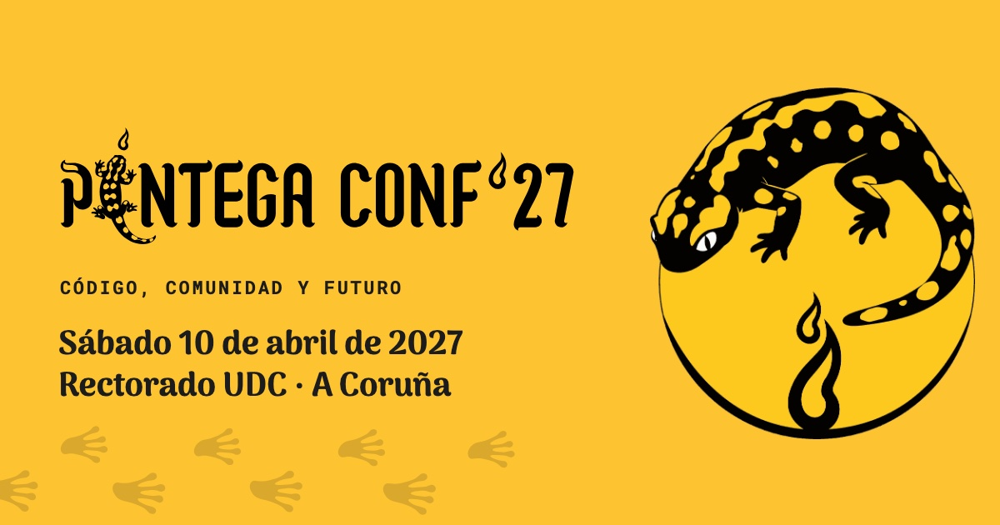

<div align="center">



# Píntega Conf '27 — web

**Código, comunidad y futuro.** La conferencia tecnológica de las comunidades tech, sucesora de Lareira Conf.

[](https://github.com/PintegaConf/pintegaconf-web/actions/workflows/web.yml)
[](https://astro.build)
[](https://nodejs.org)
[](web/site/tsconfig.json)
[](web/site/astro.config.mjs)
[](web/site/public/_headers)
[](web/README.md#análisis-de-seguridad-y-privacidad)
[](#)

📅 **Sábado 10 de abril de 2027** · charlas en el Rectorado UDC, A Coruña  
✨ **Viernes 9** · pre-evento (lugar por anunciar)

</div>

---

## Contenido

| Carpeta | Qué hay |
|---|---|
| [`web/`](web/README.md) | La web. `site/` es la web actual (Astro); `temporal/`, la página "en obras"; `tools/`, utilidades; `web_assets/`, el material de diseño original; `backup/`, la v1. **Reglas del repositorio en [`web/README.md`](web/README.md).** |
| [`claude/`](claude/README.md) | Contexto del proyecto para Claude Code e historial de decisiones. Incluye la **guía para montar el proyecto en otro equipo**. |

## Empezar en 1 minuto

```sh
git clone git@github.com:PintegaConf/pintegaconf-web.git
cd pintegaconf-web
sh claude/setup.sh              # comprueba Node e instala las dependencias exactas
cd web/site && npm run dev      # → http://localhost:4321
```

Requisitos y detalles en [`claude/README.md`](claude/README.md). Cómo está hecha la web y cómo añadir
patrocinadores, ponentes o ilustraciones del equipo: [`web/site/README.md`](web/site/README.md).

## Comandos (en `web/site/`)

| Comando | Qué hace |
|---|---|
| `npm ci` | Instala exactamente lo del `package-lock.json` (nunca `npm install` a secas) |
| `npm run dev` | Servidor local con recarga. La barra inferior de Astro incluye el panel **Audit** (accesibilidad y rendimiento) |
| `npm run build` | Verifica tipos (`astro check`) y genera `dist/`, lista para subir a cualquier hosting estático |
| `npm run preview` | Sirve `dist/` tal cual quedará publicado |
| `npm run audit` | Vulnerabilidades conocidas en las dependencias |

## Cómo está hecha

- **Astro 7, salida estática:** HTML, CSS y JS sin servidor en producción. Solo hay JavaScript donde hay interacción: equipo, carrusel, menú, tema y entrada.
- **Contenido separado del diseño:** fechas, equipo, patrocinio y ponentes se editan en `web/site/src/data/`.
- **Tema claro y oscuro** con variables CSS y un botón en la cabecera, que respeta la preferencia del sistema.
- **Seguridad y privacidad:**
  - CSP estricta con hashes y cabeceras HTTP (`public/_headers`);
  - fuentes servidas desde nuestro dominio (sin pedir nada a Google);
  - `innerHTML` nunca con datos;
  - npm sin scripts de instalación y con versiones exactas.

  Análisis completo en [`web/README.md`](web/README.md).

## Reglas

- 🔒 **El repositorio es privado** y debe seguir siéndolo.
- ✂️ **Commits pequeños y bien explicados:** un cambio por commit, y el mensaje dice qué cambia, por qué y qué se probó.
- ✅ **Antes de subir:** `npm run build` sin errores y el panel **Audit** sin avisos nuevos. Probar también en **Safari** (Mac e iPhone).
- 🤖 **Integración continua:** cada cambio en `web/site` pasa por el workflow **Web** (tipos, build y `npm audit`); tiene que salir en verde. **Dependabot** abre PR con actualizaciones cada semana: revisar el changelog antes de fusionar.
- 🗂️ Los dossiers, los contratos y el manual de marca **no** van en este repositorio.
